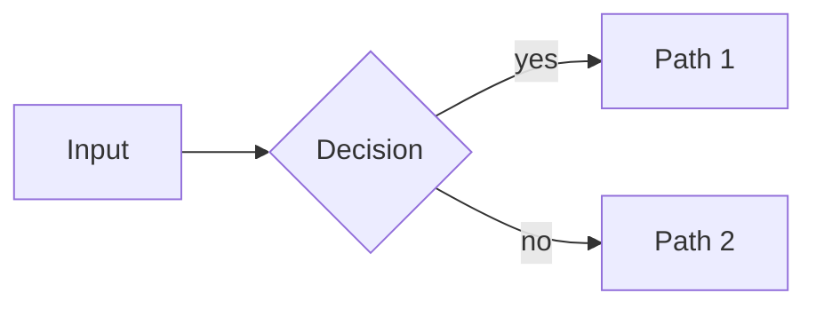

# Agent Tutor — Visualize

Good visuals are not decoration — they encode structure that text can't. Use this skill whenever a lesson note would benefit from a picture.

**Vault root:** `OBSIDIAN_VAULT` env var, else `learning/` in the current workspace. Subject assets go to `<vault>/Learning/<Subject>/assets/`.

## 1. Choose the right form

| The concept is... | Use | Mermaid type |
|---|---|---|
| A process, flow, or decision | Flowchart | `flowchart LR` / `TB` |
| A taxonomy or breakdown | Mind map | `mindmap` |
| Interactions over time | Sequence diagram | `sequenceDiagram` |
| A chronology or evolution | Timeline | `timeline` |
| System structure / behavior | Class / state diagram | `classDiagram`, `stateDiagram-v2` |
| Data relationships | ER diagram | `erDiagram` |
| A 2×2 comparison of options | Quadrant chart | `quadrantChart` |
| Proportions | Pie chart | `pie` |
| Side-by-side feature comparison | **Table** (not a diagram) | — |
| A spatial layout, annotated figure, or custom illustration | **SVG** | — |

If none fits, don't force it. A crisp table often beats a mediocre diagram.

## 2. Mermaid rules

1. **Validate before embedding.** If a `mermaid_lint` tool is available, run it on the code and fix all errors. Otherwise self-check against this list (and prefer simple constructs — they render everywhere).
2. Keep it under **~15 nodes**. Split into two diagrams if needed.
3. Short labels (< 20 chars). Detail belongs in the note text, not in boxes.
4. Direction: `LR` for pipelines/steps, `TB` for hierarchies and mindmaps.
5. Quote labels containing special characters: `A["Node (with parens)"]`.
6. Renderers support core Mermaid only — no `init` directives, no plugins, no icon packs, no HTML inside labels (except `<br/>`).
7. One diagram per idea. A diagram that needs a paragraph of explanation is too complicated.

Embed directly in the note:

````

````

## 3. SVG rules

Use SVG when Mermaid can't express it: spatial layouts, annotated figures, simple scenes, custom concept maps with precise positioning.

1. **If an `svg_save` tool is available**, use it — it validates the markup and writes to `<vault>/Learning/<Subject>/assets/<name>.svg`. Otherwise write the file yourself after checking the requirements below.
2. Requirements: `xmlns` attribute, `viewBox`, `width="100%"`, `font-size ≥ 14`, inline attributes only (no CSS classes), transparent background, works on light **and** dark themes. Security: no `<script>` elements, no `<foreignObject>`, no references to remote URLs (no external `href`). SVG files are static pictures only.
3. Embed with a relative link or wikilink to `Learning/<Subject>/assets/<name>.svg`.
4. Keep it under ~100 elements. Simple shapes + text beat elaborate art every time.

## 4. Dashboard charts

The Dashboard is not a report. Text tables carry the data (links, dates); charts carry the state at a glance. **All dashboard charts are SVG images** — full color control, they render in Obsidian, on GitHub, and in any browser, and the agent writes them with plain file tools. Mermaid stays for lesson diagrams (section 2); the Dashboard grid is SVG only, because Mermaid code blocks cannot sit inside a table cell.

**Html-mode dashboards are the exception** (`output_format.dashboard: html` in the learner profile): their charts are the inline SVG progress rings rendered by the tutor skill's html dashboard templates (Cards overview + per-subject focus pages) — no `assets/` chart files, no markdown grid, none of the recipes below. The fixed palette carries over: the html rings use the same hues. Everything else in this section applies to markdown dashboards (the default).

### Fixed palette — vibrant, no variety

| Role | Color |
|---|---|
| Accent — progress arcs, pie slices, bars | `#22d3ee` |
| Accent-deep — big numbers | `#0891b2` |
| Neutral — tracks, remainder slices, gridlines, zero-stubs | `#3f3f46` |
| Muted — labels and captions | `#8b8b8b` |

One cyan hue plus neutrals, chosen to work on light and dark themes. Do not introduce other colors.

### The grid

Embed the charts in a markdown table so they render side by side in Obsidian and on GitHub:

```markdown
| Progress | Completion | Reviews due |
|---|---|---|
|  |  |  |
```

- Use standard image syntax with paths **relative to `Learning/Dashboard.md`** — portable everywhere (wikilink embeds do not render on GitHub).
- Multiple active subjects: one `progress.svg` per subject — donuts first, then `completion.svg` and `forecast.svg`. Start a new row after three cells.
- Update the charts whenever the tables change — a stale chart is worse than text.

### Donut — `<subject>/assets/progress.svg`

Deterministic, ~15 elements:

- Circle `r="45"`, `stroke-width="16"`, `fill="none"`.
- Track circle: full ring, neutral `#3f3f46`.
- Progress arc: same radius, accent `#22d3ee`, `stroke-dasharray="<dash> 282.7"` where `dash = 282.7 · fraction` (`C = 2·π·45 ≈ 282.7`). Rotate `-90°` around center so it starts at 12 o'clock.
- Center text: the percentage (font-size ≥ 28, `#0891b2`). Labels under the donut in `#8b8b8b`: subject, n/m topics, phase.
- Obey the SVG rules in section 3 (transparent background, no scripts, no remote references).

### Completion pie — `<subject>/assets/completion.svg`

Two slices, `viewBox="0 0 200 200"`, center (100,100), radius 80:

- Completed fraction `f = done / total`, angle `a = f · 360°` from 12 o'clock clockwise.
- Arc end point: `x = 100 + 80·sin(a)`, `y = 100 − 80·cos(a)`.
- Completed slice (accent): `M 100 100 L 100 20 A 80 80 0 {1 if a > 180° else 0} 1 {x} {y} Z`
- Remainder (neutral): `M 100 100 L {x} {y} A 80 80 0 {1 if a < 180° else 0} 1 100 20 Z`
- Center: `done/total` (font-size ≥ 28, `#0891b2`). Caption in `#8b8b8b`.

### Review forecast — `<subject>/assets/forecast.svg`

Bars, one per day for the next 7 days, `viewBox="0 0 340 200"`:

- 7 bars: width 28, spacing 42, baseline `y=150`. Scale: 1 note = 60 px (`height = value · 60`).
- Value 0 → a 3 px neutral stub at the baseline.
- Bars accent `#22d3ee`, baseline and stubs `#3f3f46`, day labels (font-size 14) and title `#8b8b8b`.

## 5. Delegating to subagents

If the agent supports delegation/subagents (e.g. pi's `subagent` tool with `mermaid-maker` / `svg-maker` agents, or Claude Code subagents), hand off complex or high-effort visuals so the main conversation stays focused:

- Pass the concept, the audience level, and relevant note content.
- Review and validate the returned diagram before embedding.

The diagram and illustration work can run in parallel when a lesson needs both.

## 6. Placement in notes

- Diagram goes right after the concept it explains — never in an "appendix" at the bottom.
- Give every visual a one-line caption explaining what to notice (`*Figure: notice how X feeds back into Y*`).
- Reference the figure in the text ("as shown below").
