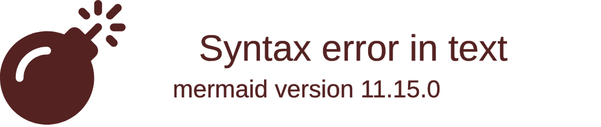

# 🎓 Learning Dashboard

> [!info] Control center
> The tutor reads this file at the start of every session. Keep it true.

## 📊 Progress

<!-- One SVG donut per subject, embedded from <subject>/assets/progress.svg -->
<!-- ![[Learning/{{subject}}/assets/progress.svg]] -->

## 📚 Active subjects

| Subject | Phase | Progress | Next up | Last activity |
|---|---|---|---|---|
| [[{{subject}}/plan\|{{subject}}]] | {{n}}/{{total}} | {{done}}/{{all}} topics | [[{{next note}}]] | {{date}} |

## 🗓️ Up for review

<!-- One bullet per due note, sorted by due date. Remove after the review is logged. -->

- [[{{subject}}/notes/{{note}}]] — {{interval}} interval, due {{date}}

## ✅ Completed

- {{subject}} — completed {{date}} ([[{{subject}}/plan|plan]])

## 📝 Recent activity

- {{date}} — {{one-line summary of the last session}}
