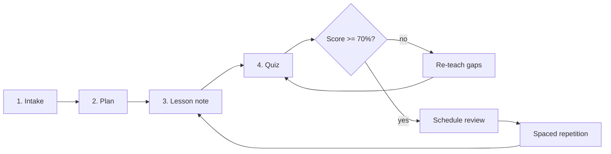

# learning-system

**Turn any coding agent into a structured personal tutor.**

Your agent writes code all day. Let it teach you something.

[](https://skills.sh/Mohamed-El-Sharqawy/learning-system)

`learning-system` gives Claude Code, Codex, Cursor, Windsurf, OpenCode, Antigravity, pi, and 70+ other agents a complete tutoring workflow: it interviews you about your goal, builds a phased learning plan, writes full lesson notes into a markdown vault you own, quizzes you with **honest, non-inflated feedback**, and schedules spaced-repetition reviews so knowledge actually sticks.

<!-- TODO: demo GIF goes here — see docs/ideas.md -->

## The loop



Every artifact — plan, lessons, quiz reports, review schedule, session logs — is plain markdown in a vault on your disk. No accounts, no lock-in, works offline. Notes use Obsidian conventions (wikilinks, callouts) but read fine anywhere.

## What you get

| | |
|---|---|
| **🎯 Goal intake** | The agent asks what, why, current level, time budget — before teaching anything |
| **🗺️ Phased plans** | 3–6 phases, topics sized for one sitting, measurable success criteria |
| **📖 Lesson notes** | Complete lessons written to your vault with diagrams, worked examples, pitfalls, and self-check questions you answer *in the note* |
| **❓ Real quizzes** | 5–8 questions mixing recall / application / transfer, 70% pass threshold, per-question explanations |
| **🧂 Honest feedback** | Never inflates. Names the exact misconception behind every miss |
| **🔁 Spaced repetition** | +1d → +3d → +7d → +14d → +30d → +90d review ladder, recall-first sessions |
| **📊 Dashboard** | Active subjects, progress, review queue, recent activity — one file the agent keeps true |

## Install

### Any agent (Claude Code, Codex, Cursor, Windsurf, OpenCode, ...)

```bash
npx skills add Mohamed-El-Sharqawy/learning-system
```

The CLI auto-detects your installed agents. Or target specific ones:

```bash
npx skills add Mohamed-El-Sharqawy/learning-system -a claude-code -a cursor
```

Three skills are included — install all, or pick with `--skill`:

| Skill | What it does |
|---|---|
| `learning-system` | The full tutor: intake → plan → lessons → quizzes → logs |
| `learning-review` | Standalone spaced-repetition review sessions |
| `learning-visualize` | Diagram selection + Mermaid/SVG standards for lesson notes |

### pi (premium install)

[pi](https://github.com/badlogic/pi-mono) users get interactive tooling on top — arrow-key quizzes with instant feedback, a styled learning-journal tool, Mermaid/SVG validators, and diagram subagents:

```bash
pi install git:github.com/Mohamed-El-Sharqawy/learning-system
```

## Quick start

1. Install the skill for your agent (above).
2. Tell your agent where your notes live — set `OBSIDIAN_VAULT` to your vault path, or just work in a folder and it creates `learning/` there.
3. Say:

> I want to learn Rust async properly. I have ~45 minutes a day.

The agent interviews you, shows a plan for approval, then teaches topic by topic — lesson notes first, quizzes after, reviews scheduled.

## The vault

```
Learning/
├── Dashboard.md                  # control center
└── Rust/
    ├── plan.md                   # phases, checkboxes, success criteria
    ├── notes/01-ownership.md     # styled lesson + self-check questions
    ├── quizzes/01-ownership-quiz.md
    ├── assets/ownership-model.svg
    └── logs/2026-02-19.md        # session journal
```

See [`examples/vault/`](examples/vault/) for a real, filled-in example.

## Why "honest feedback"?

Most AI tutors are sycophants — they celebrate a 60% and move on. This system's core rule is the opposite: **never inflate**. A 60% is "you're not there yet." Wrong answers get named misconceptions, not "review topic X." When you coast, quizzes get harder. The [review skill](skills/learning-review/SKILL.md) applies the same honesty to retention: "you've forgotten this entirely" is treated as useful information, not failure.

## Compatibility

Pure markdown skills — no runtime dependencies, work on any agent that supports the [Agent Skills](https://agentskills.io) standard. The pi extensions are optional sugar.

## Contributing

Issues and PRs welcome — especially: new templates, better review scheduling (SM-2?), and lesson-style improvements. See the vault example for the conventions.

## License

[MIT](LICENSE)
