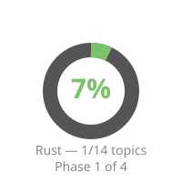
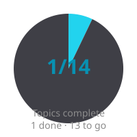
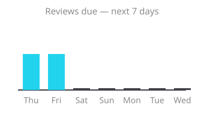

# 🎓 Learning Dashboard

> [!info] Control center
> The tutor reads this file at the start of every session. Keep it true.

## 📊 Progress

| Progress | Completion | Reviews due |
|---|---|---|
|  |  |  |

## 📚 Active subjects

| Subject | Phase | Progress | Next up | Last activity |
|---|---|---|---|---|
| [[Rust/plan\|Rust]] | 1/4 | 1/14 topics | [[Rust/notes/02-borrowing\|02 Borrowing]] | 2026-02-19 |

## 🗓️ Up for review

- [[Rust/notes/01-ownership-model]] — +3d interval, due 2026-02-21

## ✅ Completed

_(none yet)_

## 📝 Recent activity

- 2026-02-19 — Topic 1.1 Ownership model learned; quiz 6/8 (75%, passed). Watch: move semantics vs Copy types.
