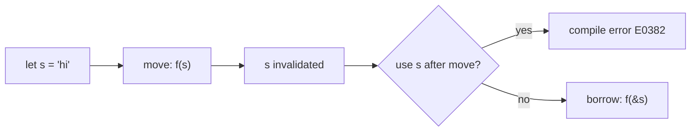

> [!abstract] In 3 sentences
> Every Rust value has exactly one **owner**, and when the owner goes out of scope the value is dropped. Assignment and function calls **move** ownership by default, invalidating the source. Stack types that are cheap to copy implement `Copy` and are duplicated instead.

## 🧠 Core concepts

**Owner.** A variable binding. The value lives as long as the owner does — no reference counting, no GC, just scope.

**Move.** For non-`Copy` types (String, Vec, Box...), `let b = a;` transfers ownership: `a` becomes unusable. The compiler enforces this at *compile time* — it's not a runtime cost, it's a static guarantee.

**Copy.** Integers, floats, bools, chars, and tuples/arrays of Copy types are duplicated on assignment. `Copy` types can't need destruction, so there's nothing to invalidate.

![[Learning/Rust/assets/ownership-model.svg]]

*Figure: the stack frame points at the heap buffer it owns; dropping the owner frees the buffer exactly once.*



> [!example] Worked example
> ```rust
> fn main() {
>     let s1 = String::from("hello");
>     let s2 = s1;                 // move! s1 is now dead
>     // println!("{s1}");         // E0382: borrow of moved value
>     println!("{s2}");            // fine — s2 owns the data
>     let n1 = 5;
>     let n2 = n1;                 // Copy — both usable
>     println!("{n1} {n2}");
> }
> ```

> [!warning] Common pitfalls
> - Coming from GC languages, "the variable still exists in my mental model" — the compiler disagrees. The error is the feature.
> - Sprinkling `.clone()` to silence E0382 works but hides the design question: *who owns this?* Fix the ownership first.
> - Function parameters take ownership by value — passing a `String` gives it away. Take `&String`/`&str` if you just need to read.

> [!tip] Pro tip
> Read E0382 errors as questions: "who should own this value when the function returns?" That reframing resolves most borrow-checker fights before they start.

## 🔑 Key takeaways
- One value, one owner, drop at end of scope — the whole model.
- Moves are compile-time transfers; `Copy` types are the exception that duplicate.
- Borrowing (`&`) is how you *use* a value you don't own — next lesson.

## ❓ Self-check — answer here in the note
> [!question] Q1 — Why does `Copy` exclude types that implement `Drop`?
> **Your answer:** …

> [!question] Q2 — `fn take(s: String)` vs `fn borrow(s: &str)`: your function only *reads* the text. Which signature, and why?
> **Your answer:** …

## 🔗 Related
- Next: [[02-borrowing]]
- Plan: [[plan]]
