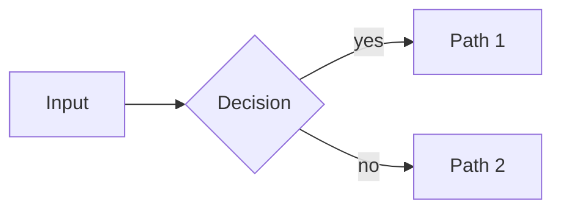

# Learning Visualize

Good visuals are not decoration — they encode structure that text can't. Use this skill whenever a lesson note would benefit from a picture.

**Vault root:** `OBSIDIAN_VAULT` env var, else `learning/` in the current workspace. Subject assets go to `<vault>/Learning/<Subject>/assets/`.

## 1. Choose the right form

| The concept is... | Use | Mermaid type |
|---|---|---|
| A process, flow, or decision | Flowchart | `flowchart LR` / `TB` |
| A taxonomy or breakdown | Mind map | `mindmap` |
| Interactions over time | Sequence diagram | `sequenceDiagram` |
| A chronology or evolution | Timeline | `timeline` |
| System structure / behavior | Class / state diagram | `classDiagram`, `stateDiagram-v2` |
| Data relationships | ER diagram | `erDiagram` |
| A 2×2 comparison of options | Quadrant chart | `quadrantChart` |
| Proportions | Pie chart | `pie` |
| Side-by-side feature comparison | **Table** (not a diagram) | — |
| A spatial layout, annotated figure, or custom illustration | **SVG** | — |

If none fits, don't force it. A crisp table often beats a mediocre diagram.

## 2. Mermaid rules

1. **Validate before embedding.** If a `mermaid_lint` tool is available, run it on the code and fix all errors. Otherwise self-check against this list (and prefer simple constructs — they render everywhere).
2. Keep it under **~15 nodes**. Split into two diagrams if needed.
3. Short labels (< 20 chars). Detail belongs in the note text, not in boxes.
4. Direction: `LR` for pipelines/steps, `TB` for hierarchies and mindmaps.
5. Quote labels containing special characters: `A["Node (with parens)"]`.
6. Renderers support core Mermaid only — no `init` directives, no plugins, no icon packs, no HTML inside labels (except `<br/>`).
7. One diagram per idea. A diagram that needs a paragraph of explanation is too complicated.

Embed directly in the note:

````

````

## 3. SVG rules

Use SVG when Mermaid can't express it: spatial layouts, annotated figures, simple scenes, custom concept maps with precise positioning.

1. **If an `svg_save` tool is available**, use it — it validates the markup and writes to `<vault>/Learning/<Subject>/assets/<name>.svg`. Otherwise write the file yourself after checking the requirements below.
2. Requirements: `xmlns` attribute, `viewBox`, `width="100%"`, `font-size ≥ 14`, inline attributes only (no CSS classes), transparent background, works on light **and** dark themes.
3. Embed with a relative link or wikilink to `Learning/<Subject>/assets/<name>.svg`.
4. Keep it under ~100 elements. Simple shapes + text beat elaborate art every time.

## 4. Delegating to subagents

If the agent supports delegation/subagents (e.g. pi's `subagent` tool with `mermaid-maker` / `svg-maker` agents, or Claude Code subagents), hand off complex or high-effort visuals so the main conversation stays focused:

- Pass the concept, the audience level, and relevant note content.
- Review and validate the returned diagram before embedding.

The diagram and illustration work can run in parallel when a lesson needs both.

## 5. Placement in notes

- Diagram goes right after the concept it explains — never in an "appendix" at the bottom.
- Give every visual a one-line caption explaining what to notice (`*Figure: notice how X feeds back into Y*`).
- Reference the figure in the text ("as shown below").
